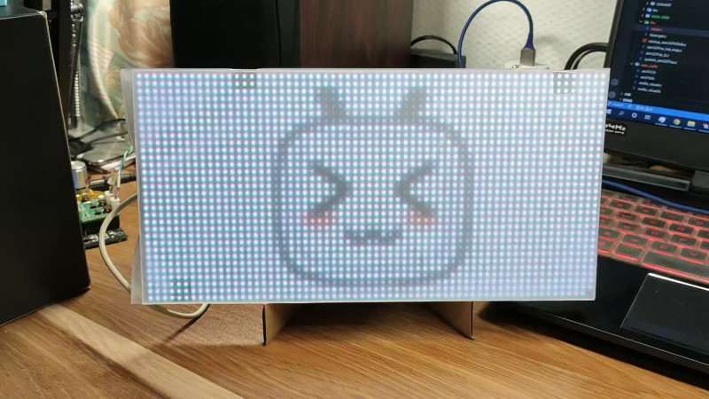
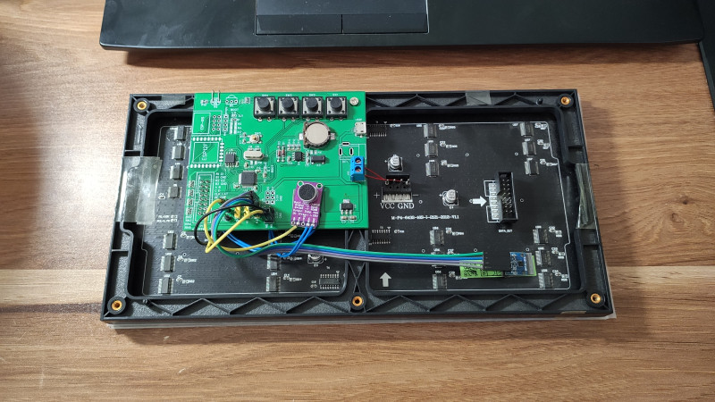
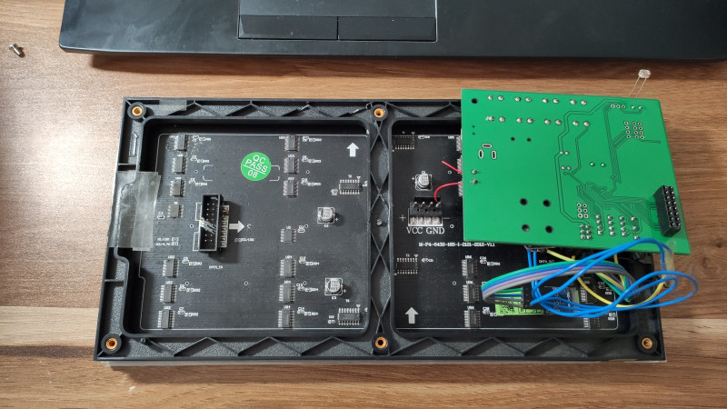

# 全彩LED点阵屏

## 简介
一个简易的全彩LED点阵屏程序，具有时钟、温度、音乐频谱、bad apple、全彩动画、文字显示等功能

硬件原理图  
https://oshwhub.com/code504/led-quan-cai-dian-zhen-ping_copy_copy

软件源码  
https://gitee.com/dma/full-color-led-screen

视频演示  
https://www.bilibili.com/video/BV1t541127oo/

  
  
  

## 硬件说明

### 屏幕规格
尺寸：256mm * 128mm  
分辨率：64 * 32  
接口：HUB75  
规格：P4，全彩，16扫  

### 外设
时钟芯片：PCF8563  
温湿度芯片：SHT30  
麦克风：MAX9814  
存储：任意型号SPI NOR Flash  

### 预留外设
预留VS1838B或兼容型号的红外接收管，可实现遥控操作  
预留ESP8266常用的两种封装，可以联网以实现更丰富的功能  
预留USB、DC、接线柱三种供电方式  
预留1路PWM，可接蜂鸣器等  

### 其他
疫情原因，买的LED柔光板没有到货，所以用普通的透明塑料板加磨砂的塑料袋做了一个临时的柔光板。
如果LED直径比较大就买厚一点的柔光板，具体效果需要自己调试。

众所周知，自从2021年开始STM32F103系列的单片机价格飞涨，现在根本玩不起了，我是用手头的存货做的，这里给出两个备选方案：
1. 使用国产 GD32 系列代替，本人手头暂时没有 GD32 系列芯片，因此无法验证是否能够完美替换，有替换成功的小伙伴欢迎评论区留言分享给大家。
2. 使用 STM32 其他PIN to PIN兼容的芯片替换，例如 STM32F401、STM32F411 几乎和 STM32F103 完全兼容，只有个别引脚不一样，而且 STM32F4 比 STM32F1 性能更强，完全可以做更复杂的程序。本人手头暂时也没有F4的芯片，同样欢迎替换成功的小伙伴给大家分享。（F4 的这两款芯片目前（2022.5.1）的价格大约在35元左右）
3. 用其他芯片重新做一个（狗头.jpg）

## 软件说明

### 软件架构
串口1 调试接口
串口2 预留ESP8266
ADC0 光敏电阻，实现自动亮度
ADC1 音频输入
定时器1 以24kHz频率中断，负责ADC音频采样
定时器3 以100Hz频率中断，负责按键扫描和屏幕刷新

### 音乐频谱
1. 音频输入
音频输入两种方式：3.5mm音频接口输入、麦克风采集输入
这两种方案的优缺点很明显。
3.5mm接口输入的信号非常干净，没有噪声，但当你想要听歌时必须给手机或电脑插上音频线，同时需要一个1分2的转接头一路输出到点阵屏、另一路输出到耳机或音响，使用比较麻烦，更何况现在绝大多数手机都不具备这种“十分先进”的音频接口。
麦克风采集就没有这么麻烦，随时都可以用，缺点就是周围的环境噪音也会被采集。
我这里采用的是麦克风采集的方案，记得一定要选用 MAX9814 等类似的具备自动增益功能的麦克风模块，这会省去你很多麻烦。千万不要用普通的麦克风模块，那是你噩梦的开始。
2. ADC采样
一般音乐的采样率是44100Hz，一般而言10KHz以上的高频声音会让听感更丰富，但是这部分声音所携带的能量也比较小，在频谱上的幅度也比较小，视觉效果不好，更何况我是用麦克风采集也会引入更多的噪声，所成我这里主要采集10KHz以下的音频信号，根据奈奎斯特采样定理，采样率应不低于20KHz，我这里采样率频率设置为24KHz。24KHz以上的信号会发生频谱混叠，合理的处理方法是加窗函数，比如 Hamming窗或 Hann窗等，这里会引入额外的计算量，我试了一下不加窗的效果也还行，所以这一步偷懒了。
3. fft性能优化
STM32F1没有FPU，所以浮点运算的性能非常差，这里对kissfft库简单进行了配置，使用256点采样，数据格式为int16，一次fft耗时不到1ms。
4. 开方运算优化
fft的结果不能直接拿来用，还要进行模运算，这里也需要优化。屏幕的刷新率是100fps，也就是每秒要进行 100 * 64 次开方运算。math.h函数进行开方运算性能非常差，直接将帧率拉到50fps以下，视觉效果感觉比较卡顿。所以这里采用牛顿迭代法进行开方，整数开方误差可能无法收敛到所需要的精度，但是没关系，频谱主要看的是视觉效果，因此不需要非常精确的计算结果。
5. 对数运算优化
频谱显示的Y坐标都是取对数进行显示，同样为了避免浮点运算，这里改成了求整数最高位1的位置，相当于以2为底取对数，之后对计算结果再做一些适当处理就可以得到不错的视觉效果了。

### 如何生成动画
前提条件：会基本的命令行操作
1. 准备ffmpeg
在ffmpeg官网(https://www.ffmpeg.org/download.html)下载对应系统的 release 版本，记住是release版本，不要下载源码
2. 准备视频
随便准备一个视频，以下命令会自动将视频文件转换成一大堆BMP文件
`.\ffmpeg.exe -i video.mp4 -vf scale=48:32 -frames 400 %04d.bmp`
这里简单解释一下这些命令参数
`-i video.mp4` 要转换的文件名
`-vf scale=48:32` 视频缩放尺寸，我的屏幕是64x32，假设想要转换一个4:3的视频并在不拉伸的情况下铺满屏幕，简单计算一下缩放后的长宽就是48x32
`-frames 400` 转换前N帧
`%04d.bmp` 输出文件名
更详细的用法`ffmpeg.exe -help full`自己看
3. bmp转单片机可以播放的格式
使用我的这个小工具 https://gitee.com/dma/bmp_to_bitmap
它可以批量转换bmp图片到指定格式，具体用法看简介，用着不爽就自己动手改
4. 烧写
代码预留了擦除flash和烧写flash的功能，输入命令记得带`\r\n`
串口输入`erase_spi()`擦除芯片，等待擦除完成
串口输入`write_spi()`，然后使用串口工具的发送文件功能发送上一步生成的bin文件
5. 播放
自己做（狗头.jpg）

### 字体
字体都是用 `PCtoLCD2002` 生成，配置为：阴码，逆向（低位在前），列行式，字符表按GB2312或GBK编码排序
如果用的字不多，可以像这个工程一样，只生成必要的汉字，将字符直接少写道单片机中。
如果要显示大量字符，建议生成完整的GB2312或GBK字库，放在外置flash中，并自行实现字库的查找功能。

### 刷新率测试
测试条件：
MCU主频：72MHz
屏幕颜色：纯白色
颜色模式：RGB565
关闭所有中断，循环刷屏刷新1000次耗时

| 亮度  | 耗时  |
| :---: | :---: |
|   1   |  4889ms  |
|   2   |  4930ms  |
|   3   |  4972ms  |
|   4   |  5013ms  |
|   5   |  5054ms  |
|   6   |  5096ms  |
|   7   |  5147ms  |
|   8   |  5179ms  |
|   9   |  5220ms  |
|  10   |  5261ms  |
|  15   |  5468ms  |
|  20   |  5675ms  |
|  30   |  6088ms  |
|  40   |  6520ms  |
|  50   |  6915ms  |

室内使用的情况下屏幕亮度在1到10之间就足够了，亮度更高需要的电流也更大，LED发热也更严重。

## 其他说明

### 是否使用 MicroLIB
本工程代码兼容使用或不使用 MicroLIB，没有特殊应用等情况下建议使用 MicroLIB ，不使用 MicroLIB 编译后代码体积会大一些，具体大多少要看使用了多少标准库函数。

不使用 MicroLIB 最常见的一个问题：
`Error: L6200E: Symbol __stdout multiply defined (by retarget.o and stdio.o).`
解决方法参见：
https://developer.arm.com/documentation/ka003082/latest
以及这篇文章中的 `RESOLUTION FOR SEMIHOSTING ISSUE` 章节
https://developer.arm.com/documentation/ka003082/latest

### 显示图片有偏色
不同的led规格不同，和显示器比肯定有色差，想要获得比较好的图片显示效果需要手动在电脑上调整图片的亮度、色度、伽马等，将调整后的图像再放到点阵屏上显示，重复这个过程直到你满意为止。有能力的话可以自己开发在单片机上调整图像的功能

### 关于驱动更大的点阵屏
实际测试点阵屏的刷新率低于50Hz时，闪烁就很明显了，眼睛看着难受，可以根据上文刷新率的测试结果进行简单估算。例如，假设使用STM32F1驱动一个80x40的点阵屏，亮度为1时刷新一屏大约需要 (80 * 40) / (64 * 32) * 4.889 = 7.76 ms。如果想要驱动更高分辨率的点阵屏，就需要优化代码、更换新能更强的单片机等。
